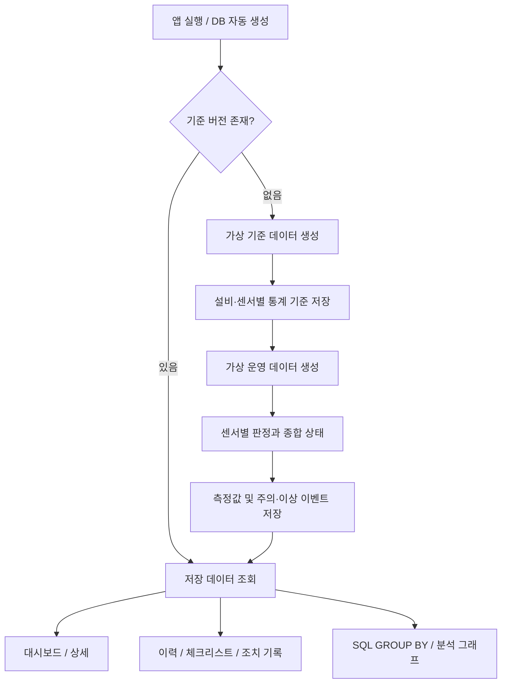

# SEMI-GUARD

**설비 데이터 기반 이상 판정 및 점검 기록 시스템**

가상 반도체 설비 3대(`EQ-01`, `EQ-02`, `EQ-03`)의 온도·압력·진동을 생성하고, 통계 기준으로 정상·주의·이상을 판정하는 Python 개인 학습 프로젝트입니다. 작업자는 추세를 확인하고 센서별 체크리스트, 추정 원인, 조치를 기록할 수 있습니다.

> 모든 데이터와 기준은 학습용 가상 값입니다. 실제 기업 데이터·내부 기준을 사용하지 않으며, 삼성전자 또는 다른 기업의 실제 시스템을 재현한 프로젝트가 아닙니다. 실제 설비 운전·안전 판단용이 아닙니다.

## 실행하기

Python **3.11 이상**이 필요합니다. 아래는 Windows PowerShell 명령입니다. 가상환경을 활성화하지 않고 Python 실행 파일을 직접 호출하므로 PowerShell 실행 정책을 변경할 필요가 없습니다.

```powershell
git clone https://github.com/lcww070513-blip/semi_guard.git
cd semi_guard
py -3.11 -m venv .venv
.\.venv\Scripts\python.exe -m pip install -r requirements.txt
.\.venv\Scripts\python.exe -m streamlit run app.py
```

다른 Python 버전을 설치했다면 `py -3.11`을 해당 버전으로 변경하세요. 터미널에 표시되는 로컬 주소(기본 `http://localhost:8501`)를 브라우저에서 엽니다. 종료는 터미널에서 `Ctrl+C`입니다.

macOS/Linux에서는 다음과 같이 실행할 수 있습니다.

```bash
python3 -m venv .venv
.venv/bin/python -m pip install -r requirements.txt
.venv/bin/python -m streamlit run app.py
```

최초 실행 시 `data/semi_guard.db`와 테이블이 자동 생성됩니다. 기본 초기 데이터는 설비당 기준 데이터 500개와 최근 7일의 5분 간격 운영 데이터 2,016개입니다. 시작 시각은 최초 실행 시각을 기준으로 정해지며, 날짜와 시각은 모두 **한국 시간(KST)** 으로 취급합니다.

새로고침이나 화면 이동은 데이터를 추가하지 않습니다. 사이드바의 **현재 시각 가상 데이터 추가** 버튼을 누르면 설비별 측정값 한 개씩 추가합니다. 같은 초에 중복 추가하면 안내 메시지가 표시됩니다. 같은 시드를 반복 사용하면 새 시각에 동일한 측정값이 생성되므로 다른 샘플이 필요하면 시드를 바꾸세요.

DB 경로를 바꾸려면 실행 전에 설정합니다.

```powershell
$env:SEMI_GUARD_DB = 'C:\원하는폴더\demo.db'
```

DB에는 점검 기록도 저장됩니다. 새 데모가 필요하면 앱을 종료하고 기존 DB를 백업한 다음 다른 DB 경로로 실행하세요. DB 파일은 Git에 업로드하지 않습니다.

## 기능

| 화면 | 기능 |
|---|---|
| 종합 대시보드 | 전체 및 상태별 설비 수, 오늘 이상 건수, 미조치 건수, 색상·문자 상태 카드, 최근 이상 10건 |
| 설비 상세 | 최신 센서값, 평균·표준편차·관리한계, 최근 100개 측정값과 관리한계 Plotly 그래프 |
| 이상 이력 및 조치 | 날짜·설비·센서·심각도·진행 상태 필터, 페이지 조회, 체크리스트와 원인·조치 기록 |
| 분석 | 날짜별 이상 추이, 설비×센서 히트맵, 빈도가 높은 이상 유형; SQL `GROUP BY`로 집계 |

화면 상단에는 공통으로 가상 데이터 안내를 표시합니다. 데이터가 없으면 정상으로 추정하지 않고 데이터가 없다는 메시지를 표시합니다.

## 데이터와 판정 규칙

센서 단위는 온도 `°C`, 압력 `kPa`, 진동 `mm/s`입니다. `data_generator.py`의 설비별 평균과 표준편차는 모두 임의의 학습용 설정입니다. `numpy.random.default_rng(seed)`를 사용하므로 **시드·시작 시각·개수·측정 간격·생성 설정이 같으면 같은 데이터**를 생성합니다. 시드만 같고 시작 시각이 다르면 timestamp는 달라집니다.

기준 데이터(`baseline`)는 정상 분포를 가정한 샘플이며, 운영 데이터(`operation`)와 분리합니다. 운영 데이터에는 센서별 기본 확률 6%로 주의 구간 후보, 3%로 이상 구간 후보를 주입합니다. 나머지는 정상 분포에서 추출합니다. 이 확률은 최종 판정 비율과 같지 않습니다. 정상 분포의 꼬리에서도 기준을 벗어날 수 있고, 산출된 기준 평균·표준편차가 생성 설정과 조금 다르기 때문입니다.

`threshold.py`는 **설비별·센서별** 평균과 표본 표준편차(`ddof=1`)를 계산합니다. 한 기준 버전에는 9개의 센서 기준이 있습니다. 운영 데이터를 기준 산출에 섞지 않는 이유는 큰 이상값이 표준편차를 키워 이상을 놓칠 수 있기 때문입니다.

평균을 μ, 표준편차를 σ, 측정값을 x라고 하면 다음과 같습니다.

| 센서 | 정상 | 주의 | 이상 |
|---|---|---|---|
| 온도·압력 | `abs(x−μ) ≤ 2σ` | `2σ < abs(x−μ) ≤ 3σ` | `abs(x−μ) > 3σ` |
| 진동 | `x ≤ μ+2σ` | `μ+2σ < x ≤ μ+3σ` | `x > μ+3σ` |

**정확히 ±2σ는 정상, 정확히 ±3σ는 주의**입니다. 진동은 상한만 적용하며 낮은 값은 이 규칙에서 이상이 아닙니다. 진동 하한은 DB에 `NULL`로 저장합니다. 판정은 표시용으로 반올림하기 전 원래 수치와 저장된 한계를 직접 비교합니다.

기준 데이터의 누락, 비수치·결측·무한값, 표본 부족(2개 미만), 표준편차 0은 기준 생성 오류로 처리합니다. 종합 상태 우선순위는 **이상 > 주의 > 정상**입니다. 주의 이벤트의 이탈량은 2σ 한계로부터, 이상 이벤트의 이탈량은 3σ 한계로부터의 절댓값입니다.

예를 들어 온도 3σ 상한이 86°C이고 측정값이 88°C라면 `이상`, 방향은 `상한 초과`, 이탈량은 `2°C`입니다. `sigma_distance`는 평균으로부터의 거리를 표준편차로 나눈 값입니다. 진동에서는 낮은 값의 `sigma_distance`가 커도 상한을 넘지 않으면 정상입니다.

## 설비 수와 이벤트 수의 차이

- 상태별 **설비 수**: 설비별 최신 운영 데이터의 종합 상태를 세며, 최대 합계는 3대입니다.
- **오늘 이상 이벤트**: KST 오늘 날짜에 발생한 심각도 `이상`인 센서 이벤트 수입니다.
- **미조치 이벤트**: 주의·이상 중 진행 상태가 `조치 완료`가 아닌 이벤트 수입니다.
- **최근 이상 알림**: 심각도 `이상`인 이벤트 최신 10건입니다.

한 시각에 한 설비의 온도와 압력이 모두 이상이면 이벤트는 2건입니다. 같은 이상이 다음 측정 시각에도 지속되면 새 이벤트로 저장합니다. 연속된 이상을 하나의 고장 구간으로 묶는 방식은 구현하지 않았습니다. 조치 완료는 작업 기록의 상태이므로, 완료 처리 자체가 측정값이나 설비의 현재 판정 상태를 정상으로 바꾸지는 않습니다.

## 점검과 조치

| 센서 | 체크리스트 |
|---|---|
| 온도 | 냉각 상태 확인, 센서 연결 확인, 주변 온도 확인, 재측정 |
| 압력 | 밸브 상태 확인, 배관 누설 확인, 센서 영점 확인, 재측정 |
| 진동 | 체결 상태 확인, 회전체 이상 소음 확인, 이물질 확인, 재측정 |

진행 상태는 `미확인`, `점검 중`, `조치 완료`입니다. 중간 상태에서는 일부 항목만 수행한 기록도 저장할 수 있습니다. 조치 완료는 모든 항목 체크와 추정 원인·조치 내용 입력이 필요합니다. 원인이 불명확하면 `원인 미확정`과 확인 내용을 기록합니다.

기록은 덮어쓰지 않고 추가하며, 이벤트의 최신 진행 상태와 기록을 같은 DB 트랜잭션으로 저장합니다. 다른 창에서 먼저 수정한 기록이 있으면 충돌 안내를 표시합니다. **최신 점검 기록 다시 불러오기** 버튼으로 최신 내용을 불러온 뒤 확인하고 다시 저장하세요. 체크박스는 사용자의 기록일 뿐, 실제 재측정이나 물리적 점검을 자동으로 수행하지 않습니다.

## 구조와 데이터 흐름

```text
app.py                 앱 시작과 화면 선택
config.py              설비·센서·단위·시간·공통 안내
data_generator.py     가상 기준/운영 데이터 생성
threshold.py           통계 기준 산출 및 버전 저장
detector.py            센서 판정 및 종합 상태
database.py            SQLite 스키마와 연결
service.py             초기화·추가·판정·저장 흐름
queries.py             화면 조회와 이력 필터
analytics.py           분석용 SQL 집계와 누락 날짜·조합의 0 처리
checklist.py           센서별 점검 항목
inspection.py          점검 기록 검증과 저장
views/                 대시보드·상세·이력·분석 화면
tests/                 unittest 및 Streamlit AppTest
.github/workflows/     GitHub Actions 테스트
docs/DEVELOPMENT.md     설계 이유와 학습 가이드
```



## DB 스키마 요약

| 테이블 | 주요 컬럼과 역할 |
|---|---|
| `threshold_sets` | `id`, 생성 시각·시드·기준 기간·설정 JSON·`std_ddof`; 기준 버전 |
| `sensor_data` | `timestamp`, `equipment_id`, `data_kind`, 센서 3종, `threshold_set_id`; 기준/운영 측정값 |
| `thresholds` | 버전·설비·센서, 표본 수, 평균·표준편차, 2σ·3σ 상하한 |
| `events` | 원본 측정/기준 ID, 발생 시각·설비·센서·값·방향·한계·이탈량·심각도·이유·진행 상태 |
| `inspection_records` | 이벤트 ID, 기록 시각·체크리스트 JSON·추정 원인·조치·진행 상태 |

`threshold_sets` 1개에 `thresholds` 여러 개가 연결됩니다. 운영 측정값은 적용 기준 버전을, 이벤트는 원본 측정값과 센서 기준을 참조합니다. 한 이벤트에 여러 점검 기록을 저장할 수 있습니다. 기준 데이터는 버전 참조를 비워 둡니다.

측정값은 `(equipment_id, timestamp, data_kind)`, 센서 기준은 `(threshold_set_id, equipment_id, sensor_name)`, 이벤트는 `(equipment_id, occurred_at, sensor_name)`의 `UNIQUE` 제약으로 중복을 방지합니다. 외래키 검사는 연결마다 켭니다. 입력 값은 SQL 매개변수로 전달하며, 동적으로 선택하는 센서 컬럼은 고정 목록으로 제한합니다.

기준은 새 버전으로 저장할 수 있는 구조입니다. 현재 UI에는 재산출 버튼이 없으며, 과거 이벤트는 당시 기준을 유지합니다. 상세 그래프도 각 측정값에 연결된 한계를 표시합니다.

## SQL 분석

분석 대상은 심각도 `이상`인 이벤트이며 주의는 제외합니다. 한국 시간(KST) 기준으로 시작일과 종료일을 모두 포함하고, 조회 기간은 최대 366일입니다. 일별 건수는 날짜, 히트맵은 설비·센서, 유형 표는 센서·방향으로 `GROUP BY`합니다. 다음은 유형 집계의 핵심 형태입니다.

```sql
SELECT sensor_name, direction, COUNT(*) AS event_count
FROM events
WHERE severity = '이상'
GROUP BY sensor_name, direction
ORDER BY event_count DESC;
```

이벤트 수는 SQL에서 계산합니다. 날짜별 결과는 재귀 CTE로 날짜 목록을 만든 뒤 집계 결과와 `LEFT JOIN`하고, 설비×센서 결과는 `CROSS JOIN`으로 전체 조합을 만든 뒤 `LEFT JOIN`합니다. 두 쿼리 모두 `COALESCE`로 누락 건수를 0으로 채웁니다. pandas는 이미 집계된 결과를 히트맵 모양으로 바꾸는 `pivot`과 표시 순서 정렬에 사용하며 재집계하지 않습니다. 이벤트가 없는 기간은 이상 0건이며, 물리적 설비가 안전하다는 보증은 아닙니다.

## 테스트

저장소 루트에서 실행합니다.

```powershell
.\.venv\Scripts\python.exe -m unittest discover -s tests -v
```

생성 재현성, 통계·경계값, 진동 하한 미적용, 종합 우선순위, 중복 저장, 점검 저장 조건, 화면 동작을 테스트합니다. 테스트는 임시 DB를 사용합니다. GitHub Actions도 push/PR 시 Python 3.11·3.12에서 같은 명령을 실행합니다. 실제 실행 결과는 [Actions](https://github.com/lcww070513-blip/semi_guard/actions)에서 해당 커밋의 결과를 확인하세요.

## 데모 순서

1. 대시보드에서 설비 수와 이벤트 수가 다르게 집계되는 이유를 확인합니다.
2. 설비 상세에서 센서의 측정값과 2σ·3σ 한계를 비교합니다.
3. 이상 이력에서 이벤트를 선택하고 `점검 중`으로 중간 기록을 저장합니다.
4. 체크리스트 전체와 원인·조치 내용을 입력해 `조치 완료`로 저장합니다.
5. 이전 기록이 남고 미조치 건수가 줄었는지 확인합니다. 현재 센서 판정은 별개입니다.
6. 분석에서 날짜별 추이와 가장 빈번한 센서·방향을 확인합니다.

## 범위와 한계

실제 센서 연결, 자동 실시간 수집, 머신러닝, 원인 자동 진단, 사용자 인증, 역할별 권한, 외부 알림은 포함하지 않습니다. 분포와 센서 간 상관관계·장기 드리프트·고장 연속성은 단순화했습니다. 관리한계는 가상 데이터의 통계적 범위이며 제품 규격이나 안전 기준과 다릅니다. SQLite 기반 개인 로컬 데모이며 다수 작업자가 사용하는 운영 시스템으로 검증하지 않았습니다.


